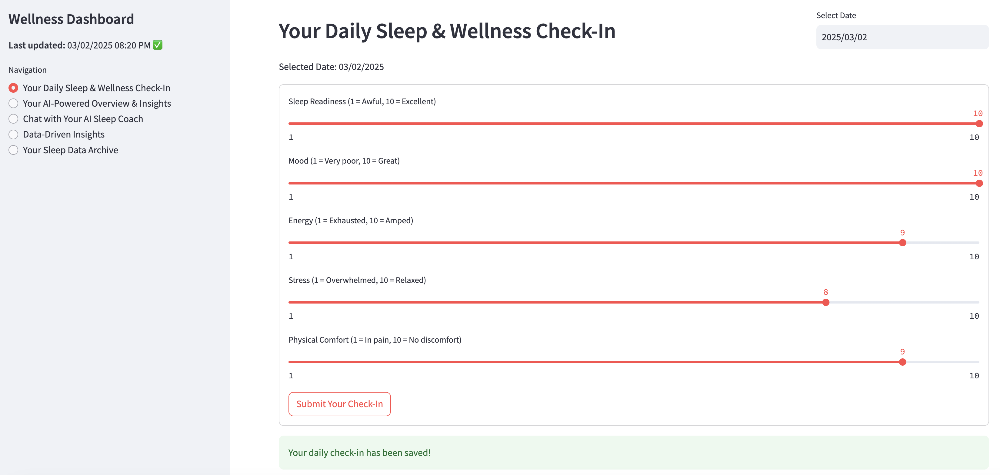
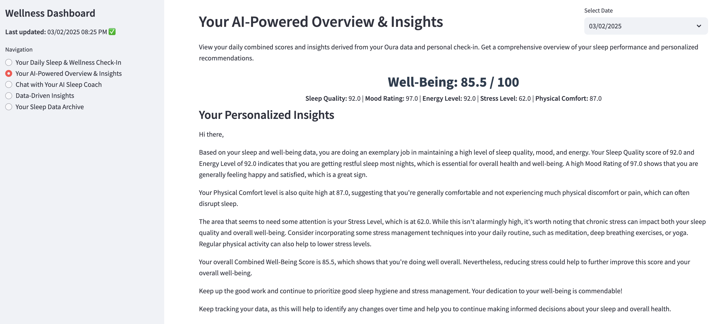
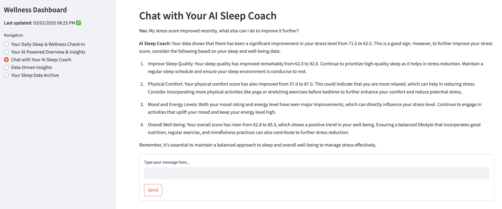
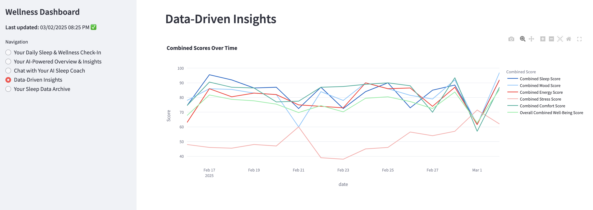
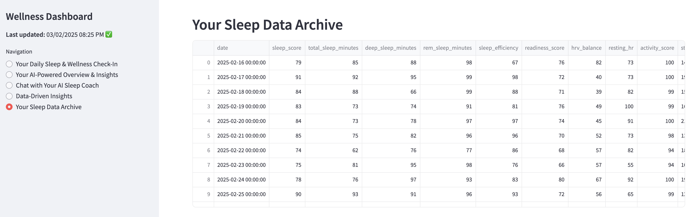

# Wellness AI Health Coach

**Wellness AI Health Coach** is an innovative, AI-driven sleep and wellness tracking application that seamlessly integrates objective data from your Oura Ring with your personal daily check-ins. By merging real-time biometric information with your subjective self-assessments, the app provides a holistic view of your sleep patterns, recovery status, and overall well-being.

## Key Features

- **Comprehensive Data Integration:**  
  Combines objective measurements from your Oura Ring—such as sleep quality, activity levels, and physiological metrics—with daily user inputs like sleep readiness, mood, energy, stress, and physical comfort.

- **Personalized Insights:**  
  Analyzes both objective and subjective data to deliver actionable insights and tailored recommendations that help you optimize your sleep and overall wellness.

- **Interactive Visualizations:**  
  Presents your data through modern, interactive charts and graphs that clearly illustrate trends and patterns over time, making it easy to understand your progress at a glance.

- **Conversational AI Support:**  
  Features an integrated chat interface powered by GPT‑4 that allows you to ask questions about your sleep data and receive immediate, data-driven advice—much like consulting a personal health coach.

## Overview

With **Wellness AI Health Coach**, complex health metrics are transformed into simple, understandable insights. The app not only monitors your sleep and wellness data but also tracks trends and changes over time, enabling you to identify areas for improvement. Whether you're aiming to enhance your sleep quality or manage daily stress more effectively, the app offers a comprehensive platform to help you achieve a healthier, more balanced lifestyle.

Experience the power of personalized wellness tracking and take control of your health with **Wellness AI Health Coach**.

---


## Features

- **Daily Sleep & Wellness Check-In:**  
  Record your daily sleep readiness, mood, energy, stress, and physical comfort using a simple slider interface.
  
- **AI-Powered Overview & Insights:**  
  View combined scores (Sleep Quality, Mood Rating, Energy Level, Stress Level, Physical Comfort) along with an overall Well-Being score. Receive personalized insights generated by an AI sleep coach.
  
- **Chat with AI Sleep Coach:**  
  Ask questions about your sleep and wellness data in an interactive chat interface that provides data-driven answers.
  
- **Data-Driven Insights:**  
  Explore interactive charts and graphs to visualize your wellness trends over time.
  
- **Sleep Data Archive:**  
  Access your historical sleep data from the past 14 days.

## Screenshots

- **Your Daily Sleep & Wellness Check-In**  
  

- **Your AI-Powered Overview & Insights**  
  

- **Chat with Your AI Sleep Coach**  
  

- **Data-Driven Insights**  
  

- **Your Sleep Data Archive**  
  


## Installation and Setup

### 1. Clone the Repository
Open your terminal and run the following commands:

```bash
git clone https://github.com/martindemel/Wellness-AI-Health-Coach.git
cd Wellness-AI-Health-Coach
```

### 2. Create and Activate a Virtual Environment
It’s recommended to run the application in an isolated environment.

MacOS
```
python3 -m venv myenv
source myenv/bin/activate
```

### 3. Install Dependencies
Install the required packages using the provided requirements.txt file:

```
pip install -r requirements.txt
```

### 4. Set Up Environment Variables
Create a file named `.env` in the project root directory with the following content:

```env
OURA_PAT=your_oura_api_token
OPENAI_API_KEY=your_openai_api_key
```
Replace your_oura_api_token and your_openai_api_key with your actual credentials.

### 5. Run the Application
The main application file is named Wellness_AI_Health_Coach.py. Start the app with Streamlit by running:
```
streamlit run Wellness_AI_Health_Coach.py
```

## How It Works

	•	Data Collection:
The app fetches sleep, readiness, activity, and SpO₂ data from your Oura Ring via the Oura API and stores it locally using SQLite.
	•	Daily Check-In:
You provide subjective ratings for your sleep readiness, mood, energy, stress, and physical comfort, which are combined with objective data to compute overall wellness scores.
	•	Personalized Insights:
An AI sleep coach (powered by OpenAI GPT‑4) generates personalized recommendations and insights based on your data.
	•	Interactive Chat:
Ask questions about your sleep data and receive immediate, data-driven responses from the AI Sleep Coach.
	•	Visualizations:
Interactive charts and graphs help you explore trends and patterns in your wellness data over time.


